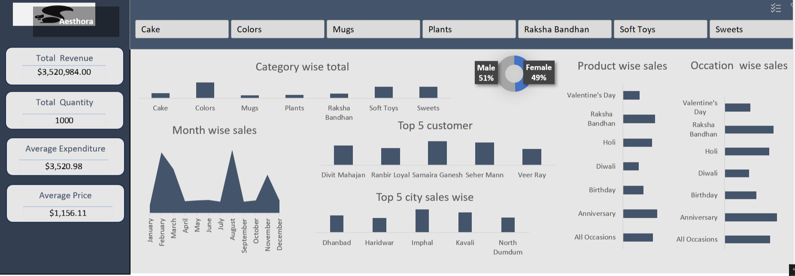

#  Aesthora Sales Dashboard

> An interactive Excel dashboard for tracking sales performance of **Aesthora** — a gifting brand. Covers revenue, customer insights, city-wise sales, and occasion-based trends.



---

## About

The **Aesthora Sales Dashboard** is a comprehensive business analytics tool built in Microsoft Excel. It gives a complete picture of sales operations — from top customers to city performance and occasion-wise buying patterns.

---

## Business Questions This Dashboard Answers

###  Revenue & Sales Performance
1. What is the **total revenue** generated by Aesthora across all product categories?
2. Which **month** recorded the highest sales, and which had the lowest?
3. What is the **average expenditure** per order, and how does it vary by occasion?
4. What is the **average price** of products sold across all categories?
5. How does **monthly revenue trend** from January to December?

###  Category & Product Analysis
6. Which **product category** (Cake, Colors, Mugs, Plants, Raksha Bandhan, Soft Toys, Sweets) contributes the most to total sales?
7. Which category has the **highest average price**?
8. What is the **total quantity sold** per product category?
9. Which **individual products** are the top sellers by revenue?
10. How do **Soft Toys vs Sweets** compare in terms of total quantity and revenue?

### 🎉 Occasion-Based Insights
11. Which **occasion** (Diwali, Birthday, Anniversary, Holi, Valentine's Day, Raksha Bandhan) drives the highest sales volume?
12. What types of products are most popular for **Valentine's Day** vs **Diwali**?
13. How does **Raksha Bandhan** sales compare to other festivals?
14. Which occasion has the **highest average order value**?
15. Are there any occasions that have **consistently low sales** throughout the year?

###  Customer Insights
16. Who are the **Top 5 customers** by total purchase value?
17. How many **unique customers** have placed orders?
18. What is the **gender distribution** of customers — Male vs Female?
19. Which customers have placed **repeat orders** across multiple occasions?
20. What is the **average quantity** ordered per customer?

### City & Location Analysis
21. Which **Top 5 cities** generate the highest sales for Aesthora?
22. Are there cities with **high order volume but low revenue** (bulk low-price orders)?
23. Which cities show **seasonal spikes** around festivals like Diwali or Holi?
24. How does **delivery time** vary across different cities?
25. Which location has the **most repeat customers**?

### Delivery & Operations
26. What is the **average delivery time** (in days) across all orders?
27. Are there any orders with **unusually long delivery periods**?
28. Which **months have the highest delivery load**, indicating peak operational pressure?
29. How does **order time of day** affect delivery performance?
30. What percentage of orders are delivered **within 5 days** vs more than 5 days?

---

## Key Metrics

| Metric | Value |
|---|---|
|  Total Revenue | $3,520,984.00 |
|  Total Quantity | 1,000 units |
|  Average Expenditure | $3,520.98 |
|  Average Price | $1,156.11 |
|  Gender Split | Male 51% / Female 49% |

---

##  Project Structure

```
aesthora-dashboard/
├── excel_dashboard_2.xlsx   # Main Excel dashboard file
├── dashboardpic.png         # Dashboard screenshot
└── README.md                # This file
```

---

##  Built With

- **Microsoft Excel** — Pivot Tables, Slicers, Charts, KPI Cards
- **Data Visualization** — Area charts, Bar charts, Pie chart, Sparklines
- **Data Sheets** — Products, Orders, Customers, Summary

---

##  How to Use

1. Download `excel_dashboard_2.xlsx`
2. Open in **Microsoft Excel 2016 or later**
3. Click any **category button** at the top to filter by product type
4. All KPIs, charts and tables update automatically

---


Made with ❤️ — feel free to fork and explore!# Aesthora-Sales-Dashboard_excel
